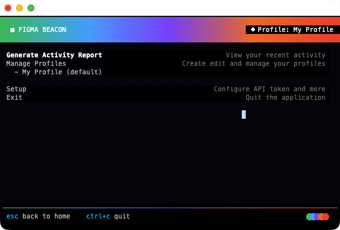

# FIGMA BEACON

A powerful terminal user interface (TUI) application for tracking and reporting your Figma activity. Monitor your team's projects, track file modifications, and generate beautiful activity reports directly from your terminal.



## Features

### Profile Management
- **Create monitoring profiles** - Define which Figma teams and projects you want to track
- **Multi-project tracking** - Select multiple projects within a team to monitor
- **Profile storage** - Profiles are saved as `.beacon` files in `~/.config/figma-beacon/profiles/`
- **Profile wizard** - Step-by-step guided flow for creating new profiles
- **Profile editing** - View, edit, and delete existing profiles
- **Default profile selection** - Set a default profile for quick report generation

### Activity Report Generation
- **Track file activity** - Automatically detect files created or modified within a time window
- **Flexible time windows** - Choose from multiple reporting periods:
  - Last Week (7 days)
  - Last Month (previous calendar month)
  - This Month to Date
  - Last 4 Weeks (28 days)
  - Last 30 Days
- **Smart activity detection** - Identifies both newly created files and modified existing files
- **Project-grouped reports** - Files are organized by their parent project
- **Markdown format** - Beautiful, readable reports with clickable Figma file links
- **Terminal rendering** - Reports are rendered in the terminal using Glamour with syntax highlighting
- **Export to file** - Save reports to `reports/` directory for sharing or archival

### Figma API Integration
- **User information fetching** - Automatically retrieve your Figma user ID, handle, and email
- **Team project discovery** - Browse and select projects from your Figma team
- **File metadata retrieval** - Access file names, modification dates, and creation timestamps
- **Version history tracking** - Query file version history to determine creation dates
- **Secure token storage** - API tokens are stored locally in configuration files

### Configuration Management
- **Persistent configuration** - Settings saved to `~/.config/figma-beacon/config.json`
- **API token management** - Securely store your Figma personal access token
- **Team and user settings** - Configure team ID and user information
- **Auto-load on startup** - Configuration and profiles load automatically when app starts

### User Interface
- **Responsive layout** - Adapts to your terminal size with footer always at bottom
- **Keyboard-driven** - Full keyboard navigation (no mouse required)
- **Real-time feedback** - Animated spinners and status messages during API calls
- **Profile status indicator** - Always know which profile is currently active
- **Clean gradient design** - Beautiful rainbow gradient headers and dividers
- **Visual step indicators** - Clear progress tracking in wizard flows

### CLI Mode (Headless)
- **Command-line interface** - Run reports without the TUI for automation and scripting
- **Profile-based execution** - Use saved profiles via `-p` flag
- **Direct project/user override** - Specify projects and users directly via `-proj` and `-u` flags
- **Multiple output formats** - JSON or Markdown output to stdout
- **Flexible timeframes** - week, month, m2d (month-to-date), 4w (4 weeks), 30d (30 days)
- **Optional file saving** - Use `-report` flag to save output to reports directory
- **Stdout output** - Perfect for piping to other tools or CI/CD pipelines

## Requirements

- Go 1.24.5 or higher
- Figma personal access token ([Get one here](https://www.figma.com/developers/api#access-tokens))
- Access to a Figma team

## Installation

```bash
# Clone the repository
git clone https://github.com/jalonsogo/figma-beacon.git
cd figma-beacon

# Build the application
go build -o figma-beacon

# Run it
./figma-beacon
```

## Quick Start

1. **First-time setup**
   - Run `./figma-beacon`
   - Navigate to "Setup" menu
   - Enter your Figma personal access token
   - Click "Gather" to fetch your user information automatically
   - Enter your Figma team ID

2. **Create a profile**
   - Navigate to "Manage Profiles"
   - Select "Create profile"
   - Follow the wizard to select projects you want to monitor
   - Give your profile a name and save

3. **Generate a report**
   - Navigate to "Generate Activity Report"
   - Select a time window (e.g., "Last Week")
   - View your activity report in the terminal
   - Reports are also saved to the `reports/` directory

## CLI Usage (Headless Mode)

Run reports from the command line without the TUI interface - perfect for automation, scripting, and CI/CD pipelines.

### Basic Usage

```bash
# Run with default profile and default timeframe (week)
./figma-beacon -p default -t week

# Generate 30-day report and save to file
./figma-beacon -p myprofile -t 30d -report

# Output as JSON for processing
./figma-beacon -p default -format json | jq '.TotalFiles'

# Month-to-date report
./figma-beacon -p default -t m2d
```

### CLI Flags

- **`-p <profile>`** - Profile name to use (default: uses default profile)
  - If not specified, uses the default profile
  - Fails if no default profile exists and no override flags are provided

- **`-t <timeframe>`** - Time window for the report (default: `week`)
  - `week` or `7d` - Last 7 days
  - `month` - Previous calendar month
  - `m2d` or `mtd` - Month to date (current month)
  - `4w` or `28d` - Last 4 weeks (28 days)
  - `30d` - Last 30 days

- **`-proj <project_ids>`** - Comma-separated project IDs (overrides profile)
  - Example: `-proj "123456,789012"`
  - Must be used with `-u` flag
  - Shows warning when overriding profile

- **`-u <user_id>`** - User ID (overrides profile user)
  - Must be used with `-proj` flag
  - Shows warning when overriding profile

- **`-format <format>`** - Output format (default: `md`)
  - `md` or `markdown` - Markdown format
  - `json` - JSON format

- **`-report`** - Save report to `reports/` directory
  - Files are named: `<profile>-<timestamp>.<format>`
  - Report is still output to stdout

### Examples

**Profile-based reports:**
```bash
# Use default profile with different timeframes
./figma-beacon -p default -t week
./figma-beacon -p production -t 30d -format json
./figma-beacon -p design-system -t m2d -report
```

**Override profile with specific projects:**
```bash
# Monitor specific projects and user
./figma-beacon -proj "proj123,proj456" -u "user789" -t week

# Generate JSON report for CI/CD pipeline
./figma-beacon -proj "proj123" -u "user789" -t 30d -format json > report.json
```

**Scripting and automation:**
```bash
# Check if there were any changes this week
CHANGES=$(./figma-beacon -p default -t week -format json | jq '.TotalChanges')
if [ "$CHANGES" -gt 0 ]; then
  echo "Found $CHANGES changes this week"
fi

# Generate daily report and commit to git
./figma-beacon -p default -t week -report
git add reports/
git commit -m "Daily activity report $(date +%Y-%m-%d)"
```

**Run without TUI (headless):**
```bash
# All commands run in headless mode automatically when flags are provided
# No need to specify a special headless flag
./figma-beacon -p default -t 30d | mail -s "Monthly Report" team@company.com
```

### Notes

- **Profile override warning**: When using `-proj` and `-u` flags, the application will warn you that profile settings are being overridden
- **No flags = TUI mode**: Running `./figma-beacon` without any flags launches the interactive TUI
- **Stdout + file**: Using `-report` flag outputs to both stdout and saves to file
- **Error handling**: All errors are written to stderr, keeping stdout clean for piping

## Keyboard Controls

### General Navigation
- **↑/k** - Move up in menu
- **↓/j** - Move down in menu
- **Enter** - Select menu item / Confirm action
- **Esc** - Go back / Cancel
- **Ctrl+C** or **q** - Quit the application

### Profile Wizard
- **Space** - Toggle selection (for multi-select lists)
- **Enter** - Confirm selection and proceed to next step
- **Esc** - Cancel wizard and return to profiles menu

### Text Input
- **Type** - Enter text
- **Backspace** - Delete character
- **Enter** - Confirm input

## Configuration Files

### Main Configuration
```
~/.config/figma-beacon/config.json
```
Stores:
- Figma API token
- User ID and handle
- Team ID
- User email

### Profile Storage
```
~/.config/figma-beacon/profiles/*.beacon
```
Each profile is stored as a separate JSON file containing:
- Profile name
- Team ID
- Selected projects (IDs and names)
- Creation timestamp
- Default profile flag

### Generated Reports
```
./reports/
```
Activity reports are exported as Markdown files to this directory.

## API Endpoints Used

Figma Beacon integrates with the following Figma REST API endpoints:
- `GET /v1/me` - Fetch authenticated user information
- `GET /v1/teams/{team_id}/projects` - List projects in a team
- `GET /v1/projects/{project_id}/files` - List files in a project
- `GET /v1/files/{file_key}` - Get file metadata
- `GET /v1/files/{file_key}/versions` - Get file version history

## Development

Built with modern Go libraries:
- [Bubbletea](https://github.com/charmbracelet/bubbletea) - Terminal UI framework
- [Lip Gloss](https://github.com/charmbracelet/lipgloss) - Styling and layout
- [Glamour](https://github.com/charmbracelet/glamour) - Markdown rendering
- [Bubbles](https://github.com/charmbracelet/bubbles) - TUI components

### Project Structure
- `main.go` - Single-file application containing all logic
- All state management uses the Elm architecture pattern (Model-Update-View)
- Async operations handled via Bubble Tea commands

### Building
```bash
go build -o figma-beacon
```

## Troubleshooting

**"Failed to fetch user info"**
- Verify your Figma token is correct
- Ensure your token has not expired
- Check your internet connection

**"No profile selected"**
- You must create at least one profile before generating reports
- Navigate to "Manage Profiles" → "Create profile"

**"No file activity found"**
- The selected profile's projects may not have any activity in the chosen time window
- Try selecting a different time window
- Verify the profile contains the correct projects

## LOLcense

For {root} sake I'm a designer. Mostly all the code has been written by Claude and ad latere.

## Contributing

Contributions are welcome! Please feel free to submit a Pull Request.
